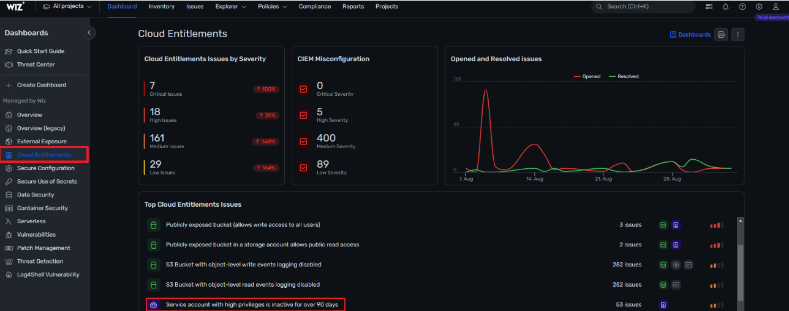
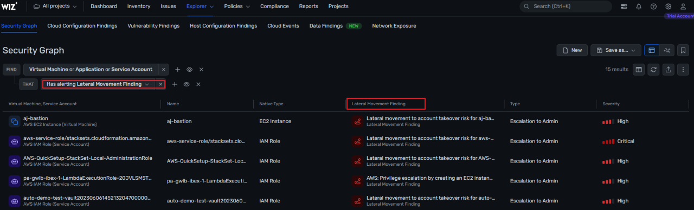

# Wiz Cloud Entitlements

Wiz is a Cybersecurity platform that provides various types of solutions of which can include tools to address identity and access risks as well as cloud entitlements. This is a brief overview from my sandbox to give a slight preview of what Wiz can offer in terms of securing a cloud environment. 

## Identify inactive Administrators & Groups

"Less is more" applies when it comes to the number of administrators or user accounts with high privileges that should be allowed in an organization. The overall goal is to reduce the number of vectors for privilege escalation which will in return reduce the number of users who might become targeted by malicious attackers. In the screenshot above, you can see there are alerts created for the previously mentioned scenario making it easy to identify stale accounts. 

It is critical to identify and delete privileged accounts as former employees and external attackers could use these to attack the organization or these accounts are simple consuming reclaimable database space. 

## Identity discontinued or unapproved 3rd Party Service Accounts

3rd Party vendors utilize IAM roles to provide their services in cloud environments thus allowing a variety of permissions into your environment. WIZ can oversee all of this and inspect the access granted by these vendors within the environment by checking for permission and least-privilege assesment. 

## Identify compute resources with no IAM 

If you have development teams that use access tokens or long term keys instead of the cloud native IAM there is a chance they could be misconfgured. In the screenshot below, you can see how WIZ identifies compute resources with no IAM that are either active or inactive as well as what cloud platform they are associated with.

## Find lateral movement paths to administrators

This can help detect the paths that attackers can potentially gain administrative permissions to your cloud environments with. It works by selecting one or more workload resources such as a VM, user account, or service accounts for example and shows you the "path"  could use to the administrator that would allow an attacker to gain full control over a cloud environment.  

In traditional on-premises data centers, security was often focused on network perimeters. However, in cloud environments, identities have become the new perimeter for managing resource access. This shift introduces new security challenges, including potential exploits of misconfigured permissions, unintended public access, and weak identity authentication.

These are just a few of the features offered by WIZ that can offer inisght into your cloud environment that will allow you to effectively addreess and identity and access risks as well as manage cloud entitlements to enhance the security of cloud environments. 