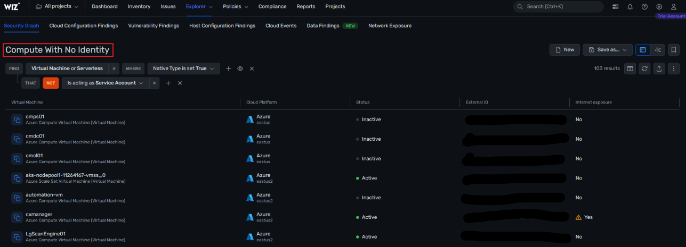

# Malware Detection 

Wiz performs scans on various components, including virtual machines (VMs), container images, and serverless functions, to detect potentially harmful software, commonly referred to as malware. Wiz will assess the seriousness of a a security threat by considering factors like external exposure and elevated privileges. When malware is identified by these controls, alerts are promptly generated. These issues demand immediate attention and action, regardless of any other risk factors associated with the affected resource.

# Identify Containers running on highly privileged hosts

The screenshot below shows the Threat Detection dashboard within Wiz. The top right, you can see the Top Threat Detection Issues which can be configured with certain rules to show specific detailed information. You can also add filters to display only issues with **Risk** type Malware if you prefer. 

Once you click on a particular issue, it opens the details drawer where you can see more information which can be seen in the following screenshots:

The description which includes the name and a brief overview of what the the malware is. 

The evidence path of the malware and the infected machines. You can click on the individual resources to view even more granular information such as cloud tags, whether it is accessible from the internnet, and even when the malware was created. 

Finally, there are remediation steps provided to protect your environment and also to help resolve the issue at hand. 

# Perform additional research on a piece of malware

If you need to perform some recon on a specific piece of malware, there are steps to do that as well. You can run queries for resources like virtual machines, container imamges, or serverless functions with malware using Security Graph. 

Click on one of the results to open the details drawer which will open on the right side of your screen. Click on vulnerability and then click on any of the associated common vulnerabilities and exposures (CVE) associated with the malware. 

Another window will open up with a detailed view into that particular CVE about where it came from and how it can be resolved. It also shows what resources within your environment it's affecting and even maps the NIST framework as well as the National Vulnerability Database to provide additional information like associated vector strings and CVSS scores.

When Wiz detects malware, it swiftly generates alerts. These alerts serve as a call to action, demanding immediate attention and resolution, regardless of any other risk factors associated with the affected resource. This proactive approach ensures that malware threats are promptly addressed to mitigate potential harm to the system's integrity and security.
